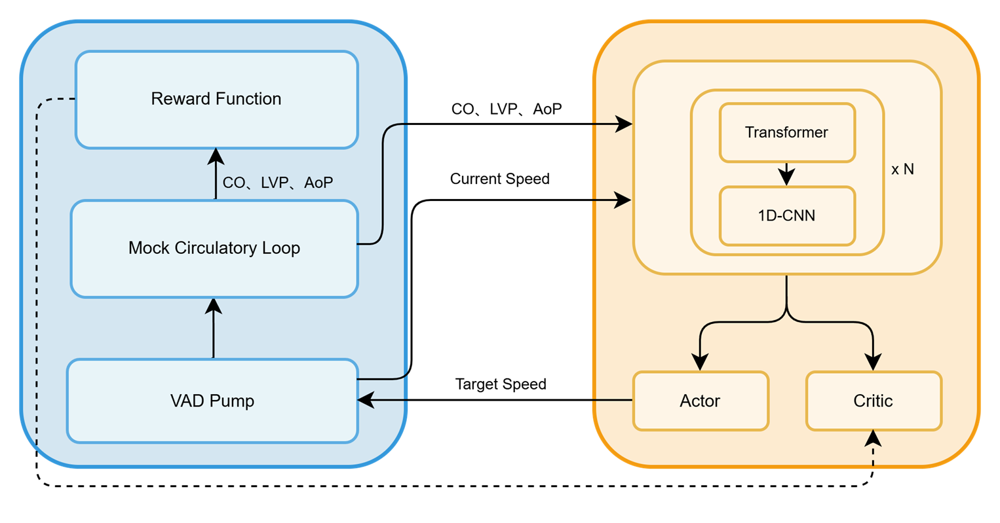

# 使用强化学习模型进行心室辅助装置的泵速自适应控制
## 模型架构
输入的信号包括主动脉压力、坐心室压力、心输出量，经过1D-CNN和transformer之后，进入Actor和Critic网络，输出动作和价值。

## 奖励函数
总奖励函数，通过加权平衡多个生理指标$$R = w_{perf} \cdot R_{perf} + w_{suction} \cdot R_{suction} + w_{backflow} \cdot R_{backflow} + w_{stab} \cdot R_{stab}$$生理灌注奖励：用于维持平均主动脉压 (MAP) 在目标范围内，确保足够的血液供应。$$R_{perf} = -\exp\left(\frac{|MAP_{actual} - MAP_{target}|}{\sigma}\right)$$抽吸惩罚：当左心室压力 (LVP) 过低时给予严厉惩罚，防止心室壁被吸入泵口。$$R_{suction} = 
\begin{cases} 
-C_{penalty} & \text{if } LVP_{min} < P_{threshold} \\ 
0 & \text{otherwise} 
\end{cases}$$反流惩罚：防止血液从主动脉倒流回左心室$$R_{backflow} = -\lambda \cdot \max(0, -Q_{pump})$$转速平滑性约束：惩罚转速的剧烈波动，防止溶血$$R_{stab} = -|\omega_t - \omega_{t-1}|$$
## 任务
用matplotlib给出使用梯度裁剪前后的训练效果图对比
### 要求
生成虚拟的训练数据：包括梯度裁剪的阈值为0.1，0.5，和1三个值和没有梯度裁剪情况下2000个step中的loss数据